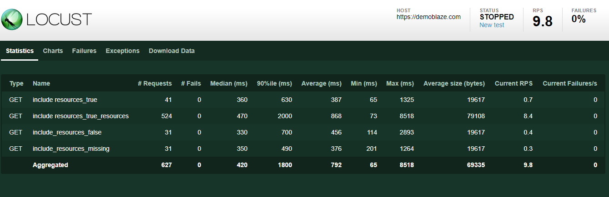

# How to include embedded resources in Locust

Below is an example using the Embedded Resource Manager plugin, but if you want a simple guide to making something from scratch, have a look [here](./manual_example.md) instead.

The following example uses the Embedded Resource Manager.

```python
from plugins.embedded_resource_manager import HttpUserWithResources
from locust import task, events
import time

class TestUserWithResources(HttpUserWithResources):

    def __init__(self, *args, **kwargs):
        super().__init__(*args, include_resources_by_default=True, default_resource_filter=".*", bundle_resource_stats=True, cache_resource_links=False)

    @task
    def include_resources_true(self):
        response = self.client.get("/", resource_filter=".*[^(js)]$")

    @task
    def include_resources_missing(self):
        response = self.client.get("/cart.html")

    @task
    def include_resources_false(self):
        response = self.client.get("/index.html", include_resources=False)
```

Let's break it down.

```python
from plugins.embedded_resource_manager import EmbeddedResourceManager

class TestUserWithResources(HttpUserWithResources):

```

The first thing is to subclass HttpUserWithResources rather than HttpUser (or FastHttpUserWithResources in the case of FastHttpUser).
That is all that is needed if accepting the default options and you can write the rest of your test as if using the standard HttpUser.
However, if you want to change the default options, add the following:

```python
    def __init__(self, *args, **kwargs):
        super().__init__(*args, include_resources_by_default=True, default_resource_filter=".*", bundle_resource_stats=True, cache_resource_links=False)
```
include_resources_by_default sets the default action for including calls to get embedded resources. This can be overridden for each request.

default_resource_filter allows resources to be excluded from lookups based on a regular expression pattern. This can also be overidden for each request.

bundle_resource_stats determines whether the report shows each individual resource or just a single line under the same name '_resources', which will be appended to the name given for that request.

cache_resource_links stores the list of links obtained for each unique response. By default it will be enabled but can be switched off if required.

In this request, the resource filter has been set with an expression to exclude JavaScript files.
```python
    @task
    def include_resources_true(self):
        response = self.client.get("/", resource_filter=".*[^(js)]$")
```

In this request, there is no include_resources flag so it will adopt the default behaviour, which in this case is to not include resources.
```python
    @task
    def include_resources_missing(self):
        response = self.client.get("/cart.html")
```

In this request, include_resources is set to false so no resources will be obtained.
```python
    @task
    def include_resources_false(self):
        response = self.client.get("/index.html", include_resources=False)
```
When we run it, we get a breakdown like this:



The example above is stored [here](./examples/EmbeddedResourceManager_example.py)
