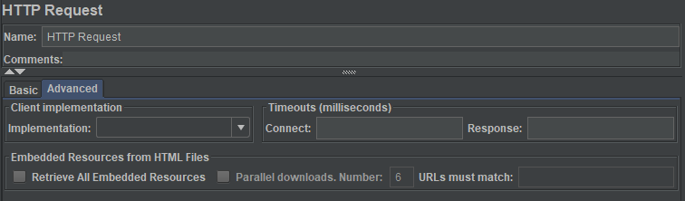
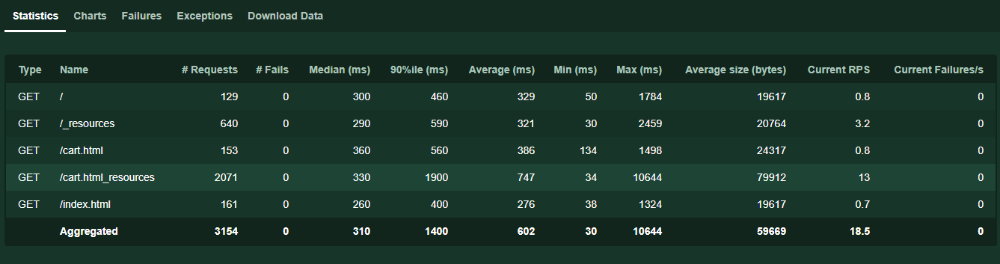

# How to include embedded resources in Locust

For JMeter users, there are a number of features that don’t come with Locust but you can still implement with relative ease.

One of those useful features in JMeter is the option to retrieve embedded resources.



By default, JMeter uses the [Lagarto HTML Parser](https://jodd.org/lagarto/) to obtain resources and if you have been using it, you’ll realise that whilst it isn’t perfect, it is a good enough approximation to a full-fat browser to be effective.

So, how can we do this in Locust?

Below is an example using the Embedded Resource Manager plugin, but if you want a simple guide to making something from scratch, have a look [here](./manual_example.md) instead.

```python
from plugins.embedded_resource_manager import EmbeddedResourceManager

class test(FastHttpUser):
    
    def on_start(self):
        EmbeddedResourceManager(self)

    @task
    def include_resources_true(self):
        name = "include_resources_true"
        response = self.client.get("/", name=name, include_resources=True)

    @task
    def include_resources_false(self):
        name = "include_resources_false"
        response = self.client.get("/", name=name, include_resources=False)

    @task
    def include_resources_missing(self):
        name = "include_resources_default"
        response = self.client.get("/", name=name)
```

Let's break it down.

```python
from plugins.embedded_resource_manager import EmbeddedResourceManager

class MyWebsiteUser(FastHttpUser):
    
    def on_start(self):
        EmbeddedResourceManager(self)
```

First we need to reference the plugin and create an instance in the on_start function of your test class. In this case we are using FastHttpUser, but it will work equally well with HttpUser.

There are several options that can be set when instantiating. By default the options are as following:

```python
    EmbeddedResourceManager(self,include_resources_by_default=False, default_resource_filter=".*", bundle_resource_stats=True, cache_resource_links=True)
```
include_resources_by_default sets the default action for including calls to get embedded resources. This can be overridden for each request.

default_resource_filter allows resources to be excluded from lookups based on a regular expression pattern.

bundle_resource_stats determines whether the report shows each individual resource or just a single line under the same name '_resources', which will be appended to the name given for that request.

cache_resource_links stores the list of links obtained for each unique response. By default it will be enabled but can be switched off if required.

In this request, the include_resources has been set to true. This will retrieve the embedded resources in this page.
```python
    @task
    def include_resources_true(self):
        name = "include_resources_true"
        response = self.client.get("/", name=name, include_resources=True)
```

In this request, include_resources is set to false so no resources will be obtained.
```python
    @task
    def include_resources_false(self):
        name = "include_resources_false"
        response = self.client.get("/", name=name, include_resources=False)
```

In this request, there is no include_resources flag so it will adopt the default behaviour, which in this case is to not include resources.
```python
    @task
    def include_resources_missing(self):
        name = "include_resources_default"
        response = self.client.get("/", name=name)
```

When we run it, we get a breakdown like this:



The example above is stored [here](./examples/EmbeddedResourceManager_example.py)
